#                                                                  PART 1. HYPERVISORS

## 1) The most popular hypervisors: 
   * 1 type: Microsoft Hyper-V, VMware ESX Server, KVM;
   * 2 type: VMware Workstation,Oracle VM VirtualBox, Microsoft Virtual PC, Parallels Desktop
## 2) The main differences:
### 1 type:
   * VMware ESX  - the most expensive product, KVM(free) - open sourse products(commercial version - RHEV);
   * KVM - not service support, does not require many resources;
   * SCVMM in Hyper-V opens up possibilities beyond simple server virtualization. You can create private clouds. 
   * VMware has Fault Tolerance, Microsoft doesn't yet.
### 2 type:
   * VirtualBox - free, oes not require many resources;
   * Parallels Desktop - more usability for Mac;
   * VMware Workstation - the most expensive;
#                                                                PART 2. WORK WITH VIRTUALBOX

1) Working with VM(Installing VM, creating VM, cloning VM, creating group):
  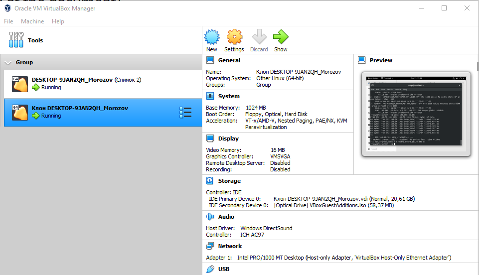
2) Making snapshots
  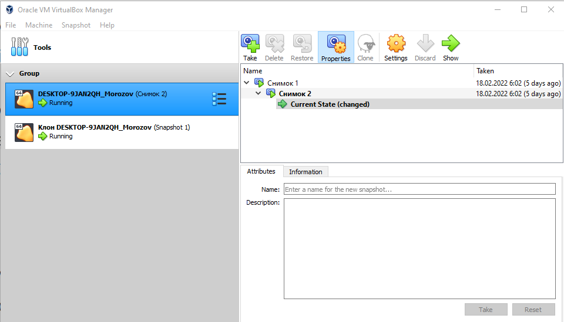
3) Export and import VM from *.ova file
  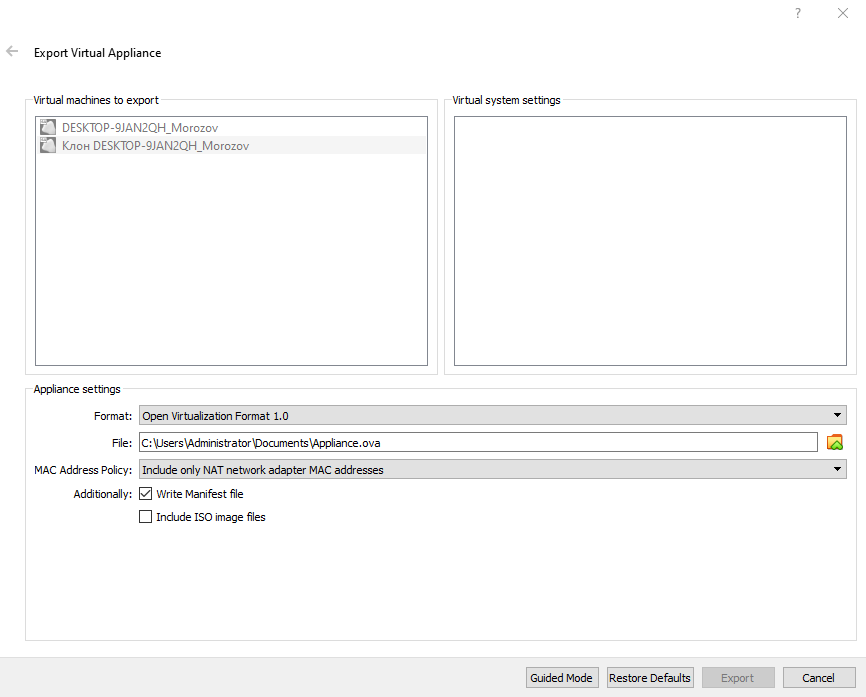
  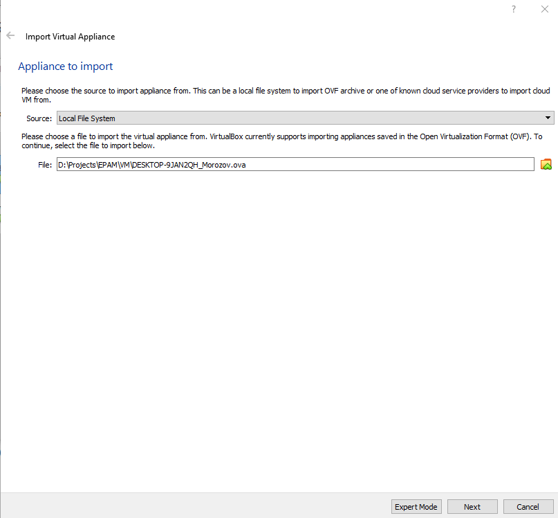
4) Сonnecting to the USB ports
  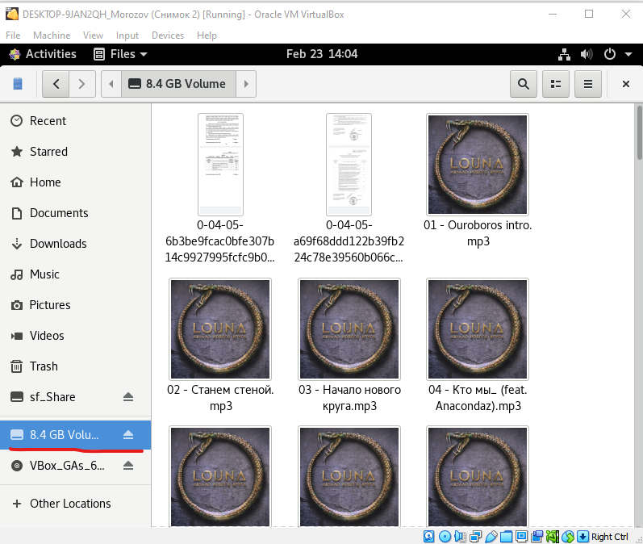
5) Configuring a shared folder to exchange data  
  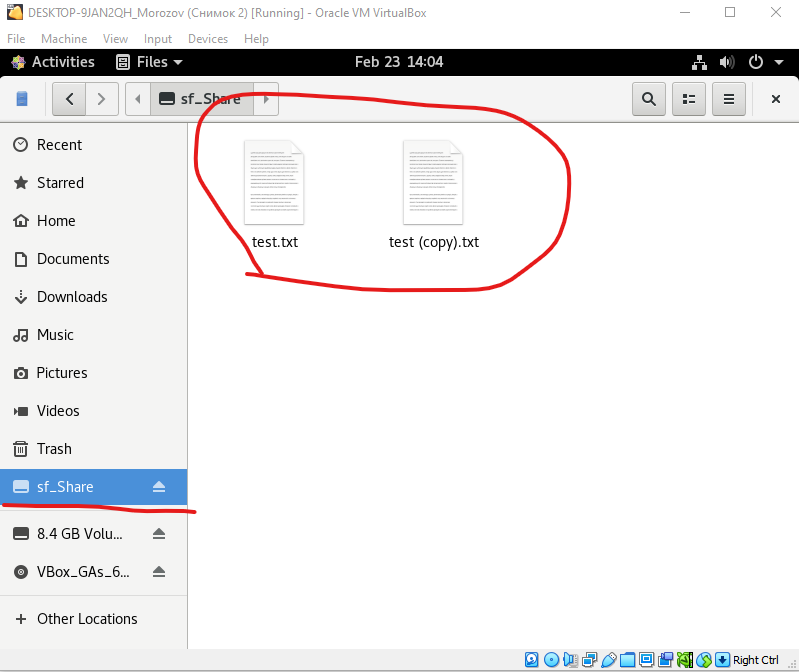
  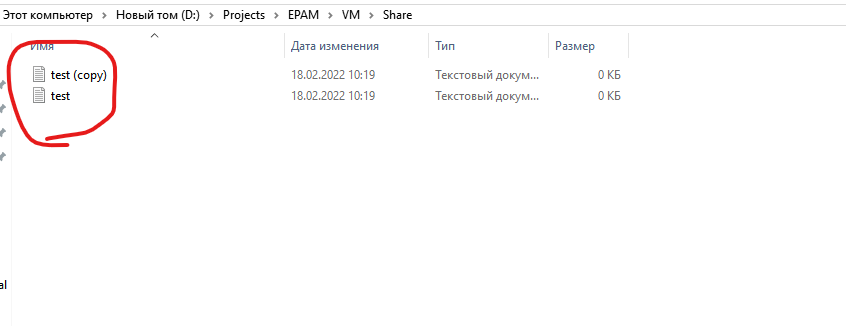
6) Working with CLI through VBoxManage.  
  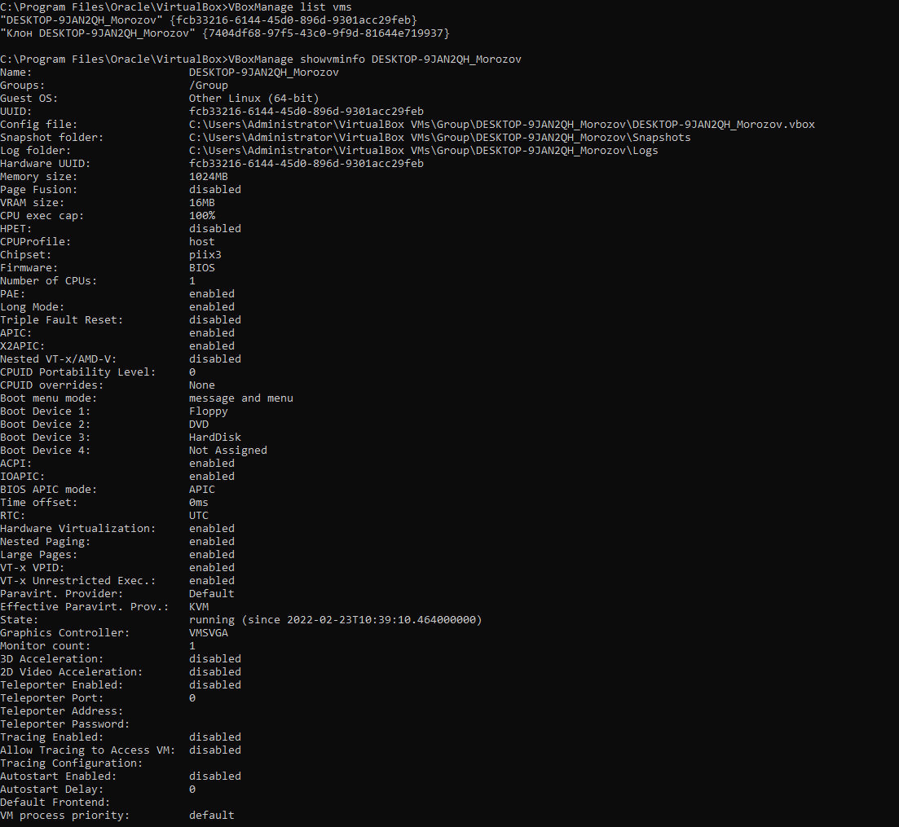
  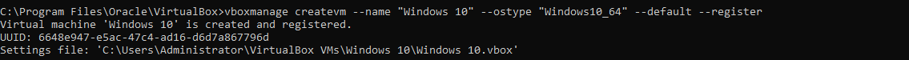
  
  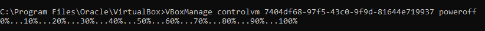
  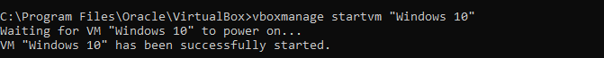
  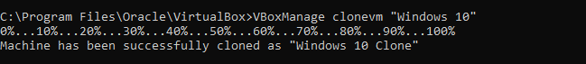
  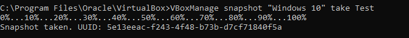
  #                                                                PART 3. WORK WITH VAGRANT

