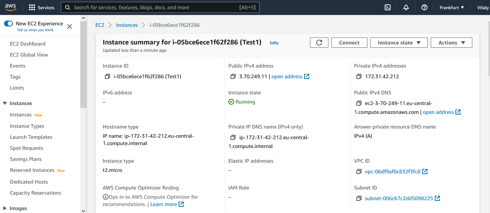

#                                                                TASK 2.2

### Review Getting Started with Amazon EC2. Log Into Your AWS Account, Launch, Configure, Connect and Terminate Your Instance. Do not use Amazon Lightsail. It is recommended to use the t2 or t3.micro instance and the CentOS operating system.

  
3) Export and import VM from *.ova file
  
  
4) Сonnecting to the USB ports
  
5) Configuring a shared folder to exchange data  
  
  
6) Configure different network modes
https://docs.google.com/spreadsheets/d/1NabNA-VBkpVm5Y9zjhdn1F91CojZMDDRcSv76FcSblY/edit#gid=0
