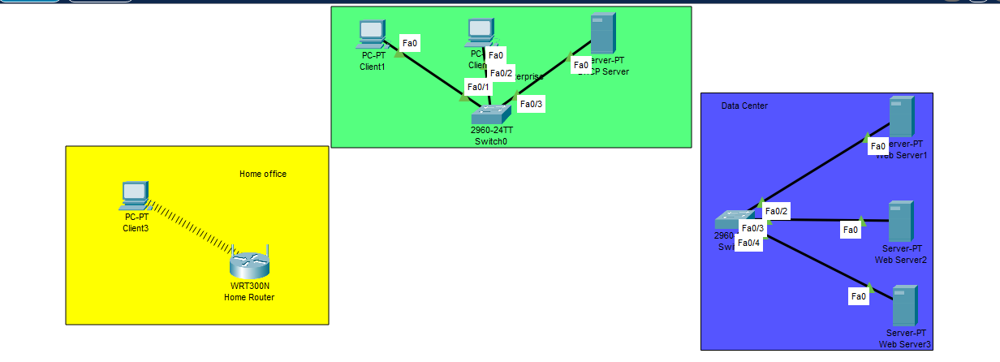
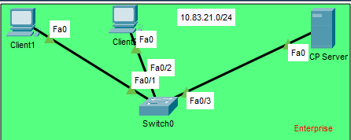
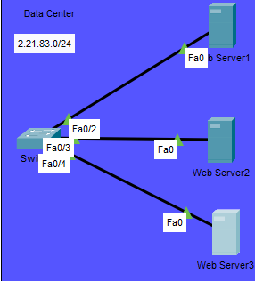
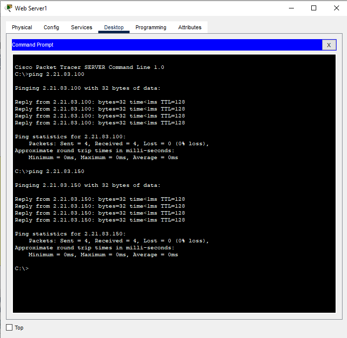
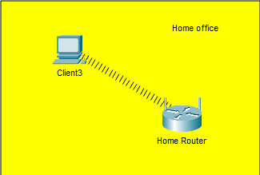
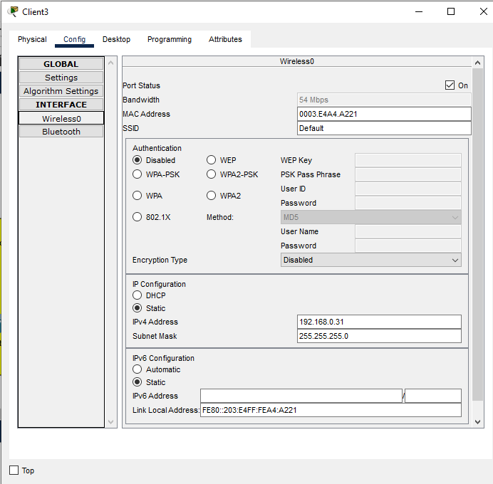
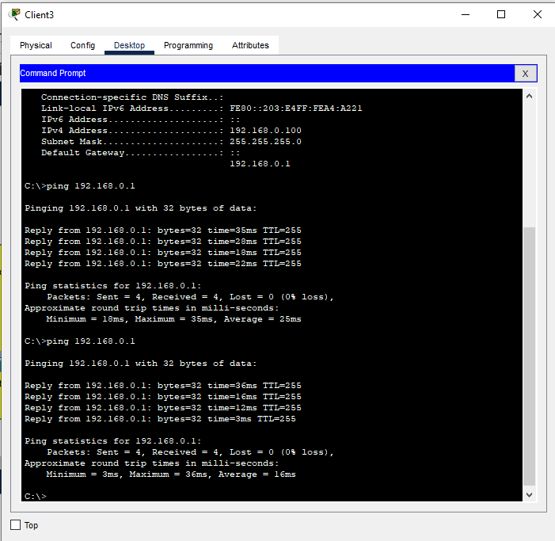
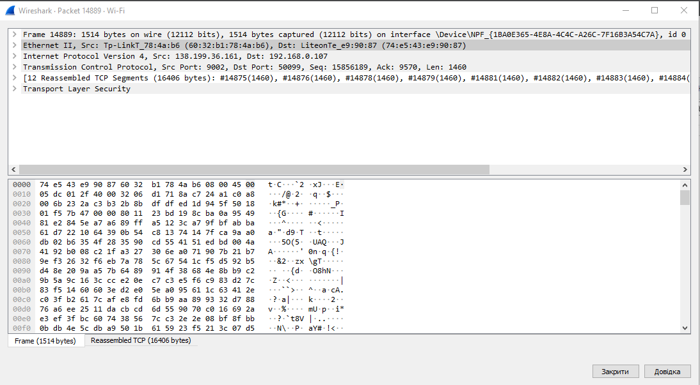

# EPAM University ProgramsDevOpsexternal courseModule –NetworkingFundamentals
## Task3.1 –Створення трьох окремих мережHome Office, Enterprise, Data Center.
### 1. Створити мережі, як показано на рис. 1. Рекомендовані моделі комутаторів Catalyst2960, безпровідний  маршрутизатор –WRT300N. В мережі Data Centerпідключити сервери до портів відповідно рис. 1
 
### 2. В  мережі Enterpriseпризначити  статичні  адреси,  сформовані  за  таким правилом: Адреса мережі 10.Y.D.0/24, де Y–дві останні цифри з вашого року народження, D–дата народження. Хостовачастина адреси Client1 –10,   Client2 –20, DHCPServer–100. Наприклад, якщо ви народились 25-го квітня  1999  р.,  то  адреса  мережі  буде  10.99.25.0/24,  а  адреса Client1-10.99.25.10/24 

### 3. Перевірити зв'язок за допомогою команди  ping

### 4.В мережі DataCenterпризначити статичні адреси,сформовані за таким правилом: M.D.Y.0/24, де М –номер місяця народження, Dі Yаналогічно попередньому. Хостова частина WebServer1 –50, WebServer2 –100, DNSServer–150. Таким чином адреса  DNSServerбуде 4.25.99.150

### 5.Перевірити зв'язок за допомогою команди  ping

### 6.На комп’ютері Client3 замінити мережевий адаптер Ethernetна адаптер Wi-Fi–модуль PT-HOST-NM-1W,  як  показано  на  рис. 2.  Результатом успішної заміни є поява бездротового зв’язку, як показано на рис. 1

### 7.Призначити Сlient3 статичну  адресу  192.168.0.(D+10). Для  нашого прикладу це буде 192.168.0.35.

### 8.Перевірити  зв'язок  з  маршрутизатором  за  допомогою  команди   ping192.168.0.1

### Додаткове завдання: Дослідження структури пакету за допомогою аналізатора пакетів Wireshark.

MAC-адреса відправника: 60:32:b1:78:4a:b6
MAC-адреса отримувача: 74:e5:43:e9:90:87
IP-адреса відправника: 138.199.36.161
IP-адреса отримувача: 192.168.0.107
TCP-порт відправника: 9002
ТCP-порт отримувача: 50099
