# Task 3.2 - З’єднання окремих мереж за допомогою мережі Internet та налаштування VLAN З’єднання окремих мереж за допомогою мережі Internet 
### 1. З’єднати створені у попередньому Taskу мережі між собою, як показано на рис. 1.
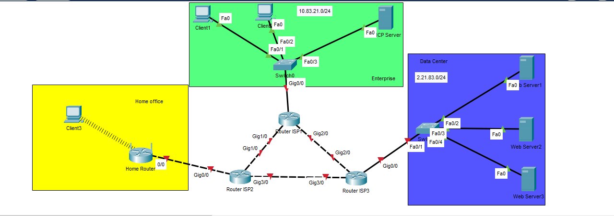
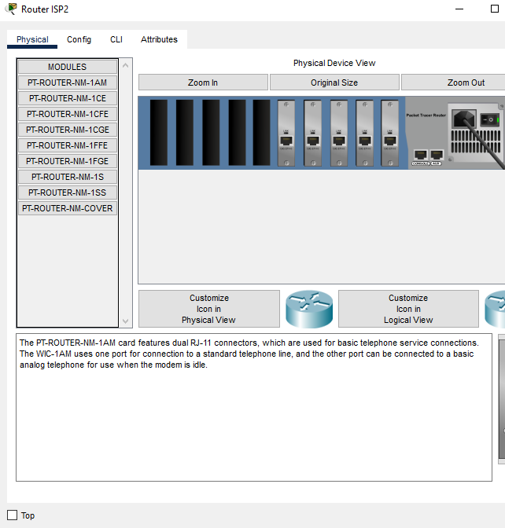
### 2. Для реалізації мережі Internet використати мережу з адресою (D+10).M.Y.0/24, поділивши її на підмережі з префіксом /26.  
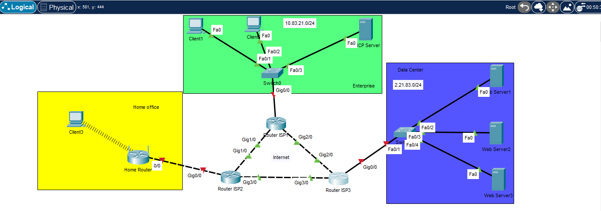
### 3. Призначити ІР-адреси інтерфейсам маршрутизаторів за такими правилами: Router ISP1 GE0/0 - 10.Y.D.1/24, Router ISP3 GE0/0 - M.D.Y.1/24. 
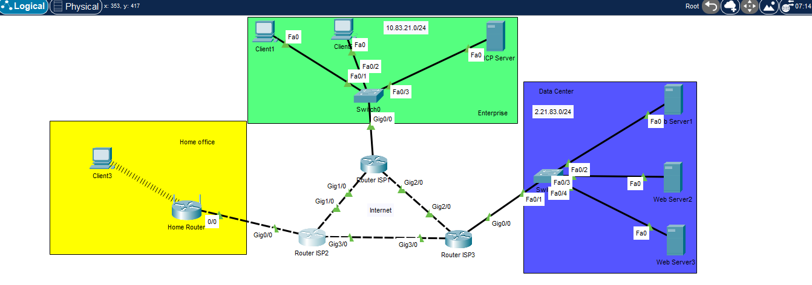
### 4. На комп’ютерах вказати адреси відповідні адреси шлюзів (Default Gateway) 
### 5. Перевірити зв'язок комп’ютерів з власними шлюзами за допомогою команди ping
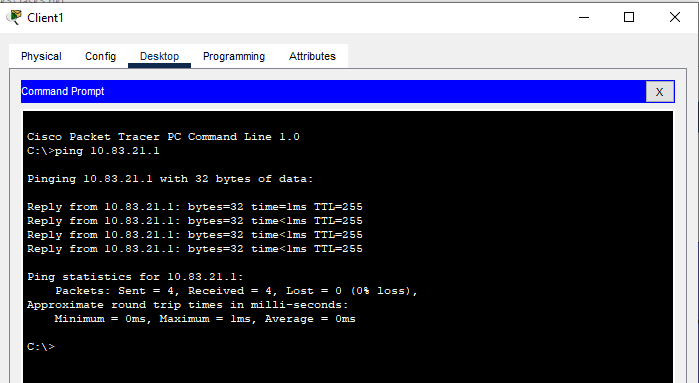
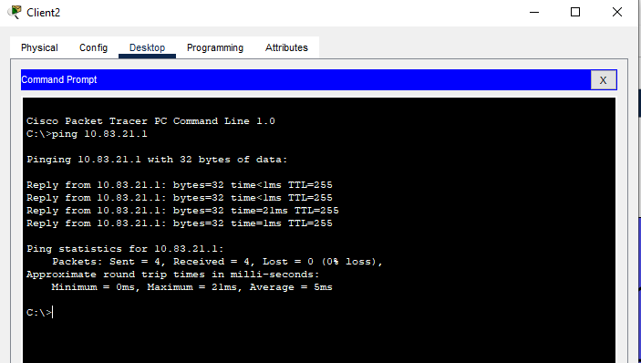
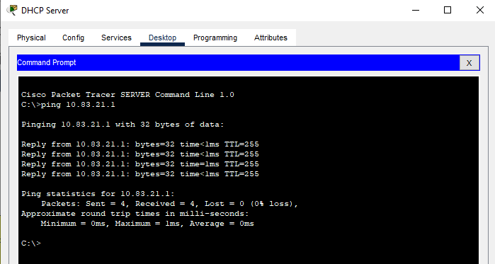
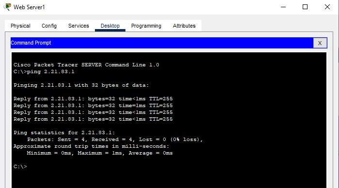
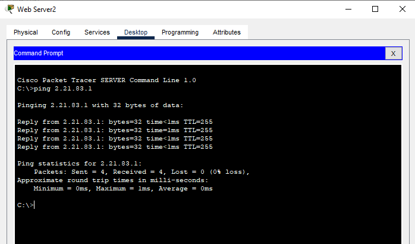
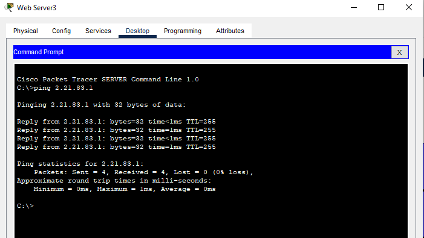
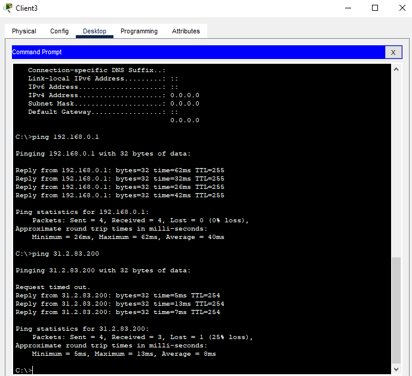
### 6. Перевірити зв’язок між серверами за допомогою команди ping та маршрут проходження пакета за допомогою tracert 
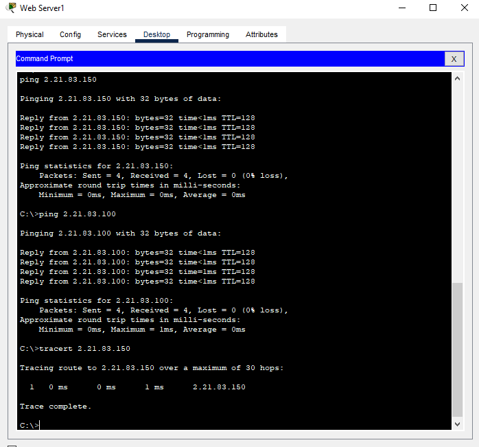
### 7. Змінити маску підмережі на серверах на 255.255.255.192
### 8. Повторити пункт 6 та зафіксувати і пояснити зміни
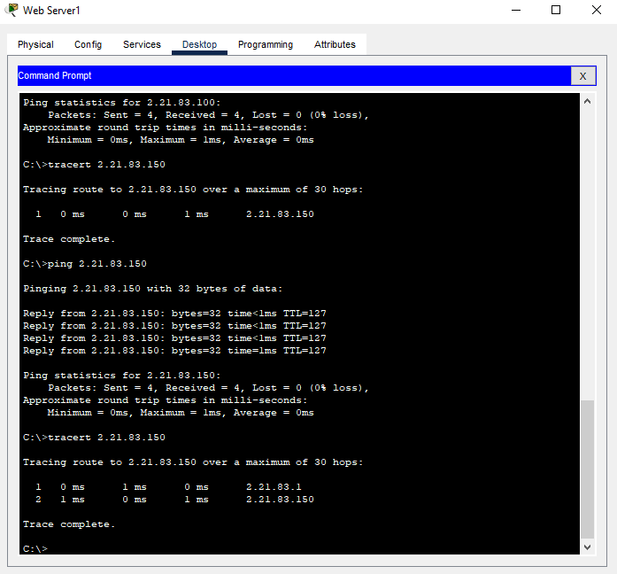
### 9. Змінити приналежність портів Switch Data Center VLAN таким чином: FE0/2 – VLAN2, FE0/3 – VLAN3, FE0/4 – VLAN4. Для цього на Switch Data Center створити відповідні додаткові VLAN, як показано на рис.4, та увести відповідні порти до відповідних VLAN, як показано на рис. 5.
### 10. Повторити пункт 6 та зафіксувати і пояснити зміни
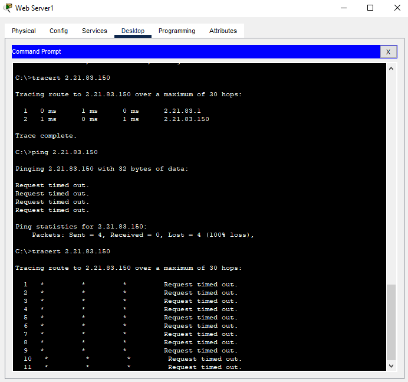
## Налаштування маршрутизації між VLAN (додаткове завдання)
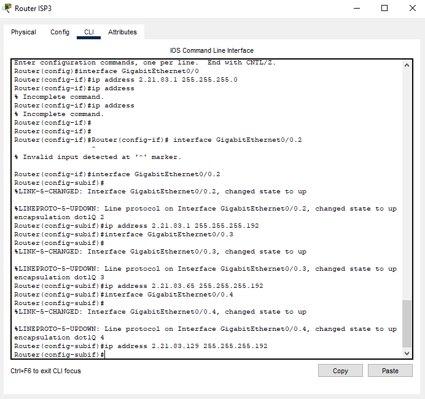
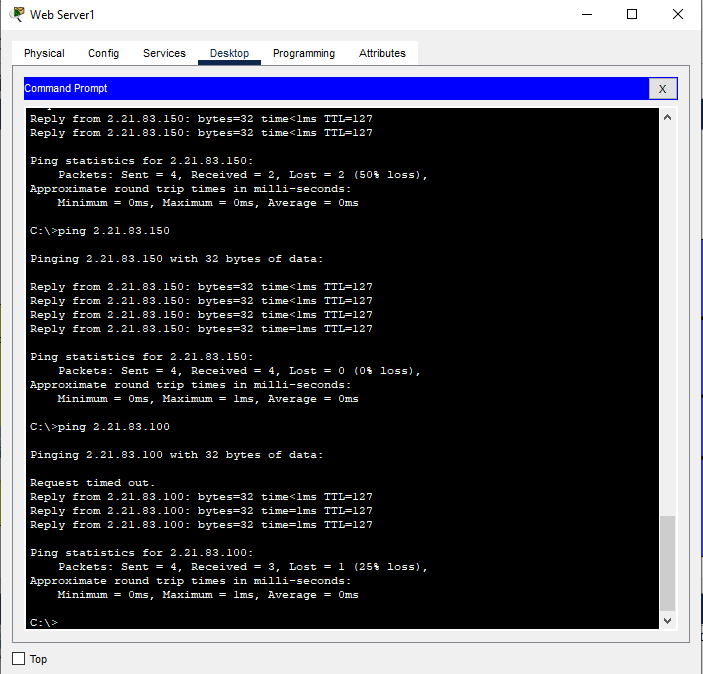
