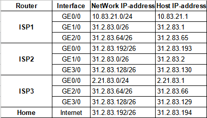
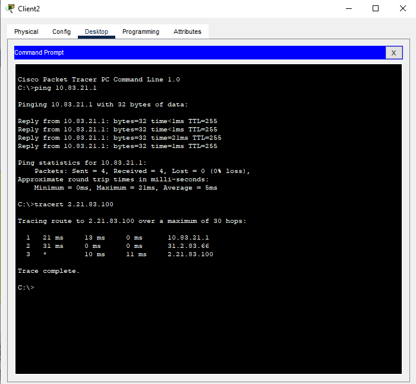
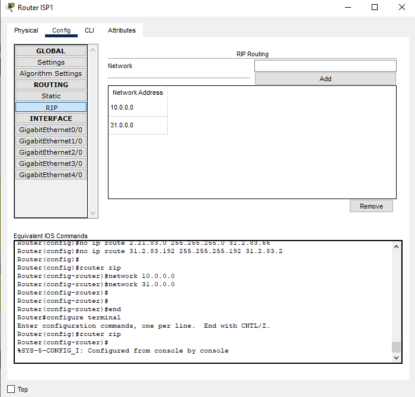
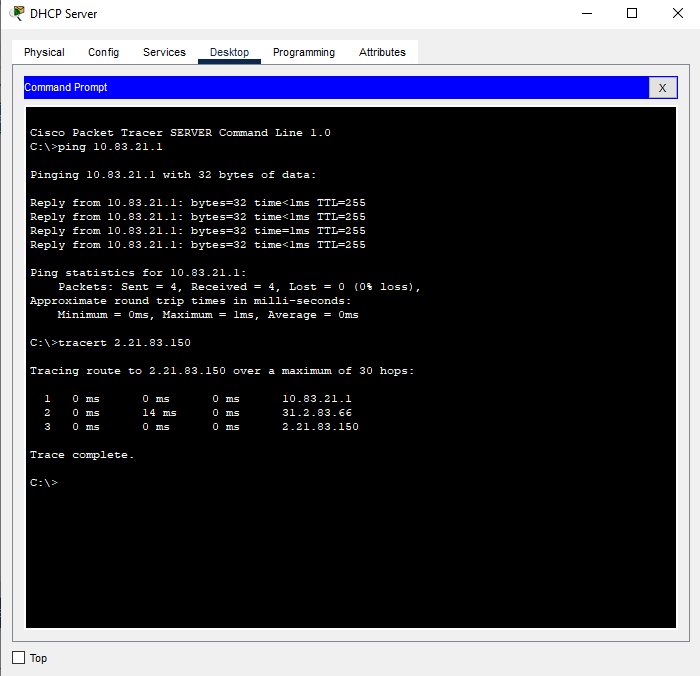

# Task 3.3 – Налаштування маршрутизації
### 1. Налаштувати таблиці маршрутизації на маршрутизаторах ISP1, ISP2 та ISP3. 
### 2. Налаштувати маршрутизацію на бездротовому маршрутизаторі Home Router, для чого додати Default маршрут на Router ISP2, як показано на рис. 3

### 3. Перевірити працездатність мережі за допомогою команди ping та tracert. 

## Налаштування динамічної маршрутизації (додаткове завдання)
### 4. З таблиць маршрутизації маршрутизаторів ISP1, ISP2 та ISP3 видалити статичні записи.
### 5. На маршрутизаторах ISP1, ISP2 та ISP3 налаштувати протокол RIP, для чого вказати перелік безпосередньо приєднаних мереж у класовому форматі, як показано на рис.5 для ISP1.

### 6. Для перевірки працездатності повторити пункт 3.

