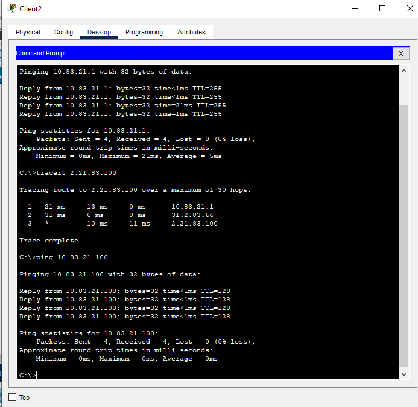
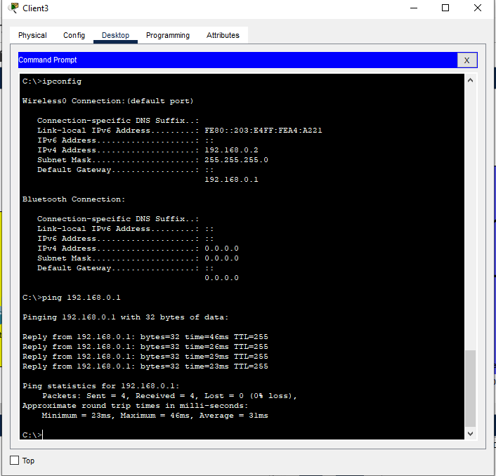
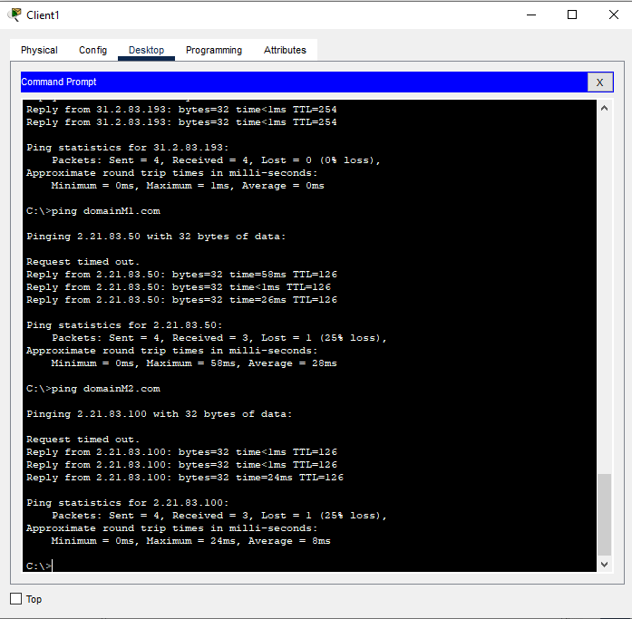
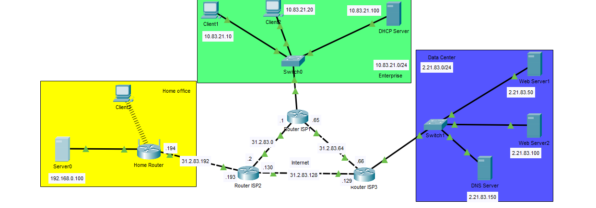
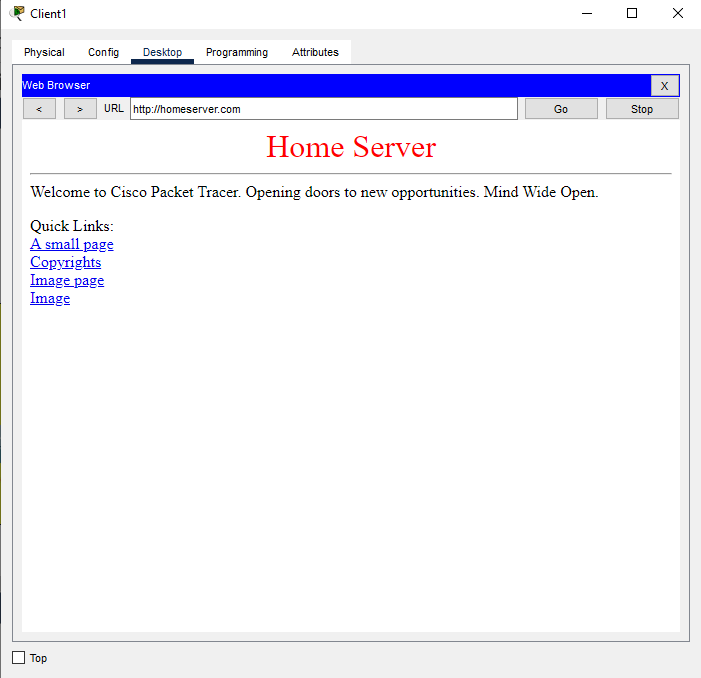

# Task 3.4 – Налаштування DHCP, DNS, NAT
### 1. Налаштувати DHCP Server в Enterprise мережі (рис.1). 
### 2. Зробити налаштування DHCP Pool, вказавши початкову адресу 10.Y.D.10 та адресу Default Gateway – адресу інтерфейсу GE0/0 Router ISP1.
### 3. Перевірити працездатність сервісу, поставивши в налаштуваннях Client 1 та Client 2 DHCP, як показано на рис. 3

### 4. Налаштувати DHCP на Home Router та перевірити працездатність на Client 3

### 5. Для налаштування і перевірки роботи DNS сервісу призначити Web Server1 та Web Server2 доменні імена, наприклад, domain1.com та domain2.com відповідно. 
### 6. Внести відповідні записи в налаштування DNS сервера, як показано на рис. 4 та увімкнути DNS service.
### 7. Додати до налаштувань DHCP серверів адресу DNS сервера та оновити налаштування на клієнтах (переключившись з DHCP в Static і назад в DHCP). 
### 8. Перевірити працездатність шляхом відправки ping з Client на доменне ім’я, як показано на рис. 5

### 9. Додати в мережу Home Office Home Server та призначити йому статичну адресу, як показано на рис. 6

### Перевірити працездатність шляхом уведення на Client1 у Desktop/Web Browser - domain3.com(в мене - homeserver.com)

### Файл проекта прилагается.
