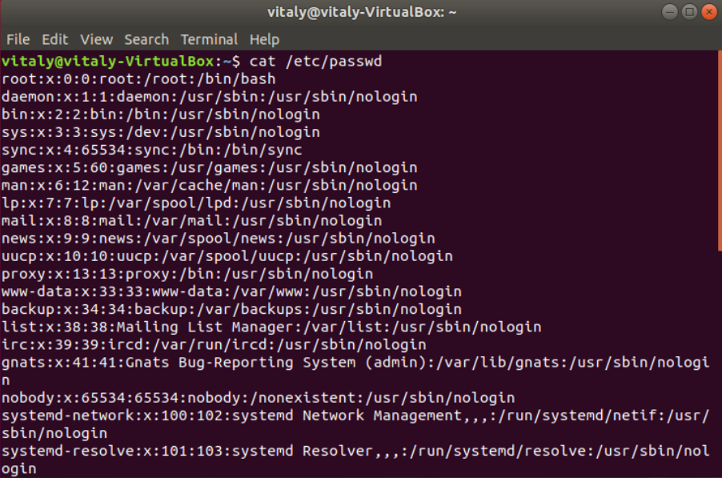

# Task2
### 1) Analyze the structure of the /etc/passwd and /etc/group file, what fields are present in it, what users exist on the system? Specify several pseudo -users, how to define them?

The "/etc/passwd" file contains information about the users on the system. Each line describes a distinct user. Each line has the next structure:

username:password:UID(user_id):GID(group_id):user_id_info(a comment field):home_directory:command/shell

The "/etc/group " file applies to the general security scheme for Unix-like systems: user, group, and file access.

group_name:password:group_id:list

These two files contain information about both real and pseudo-users. The most common pseudo-users:

  - daemon (used by system service processes)
  - bin (gives ownership of executables command)
  - adm (owns registration files)
  - nobody (used by many services)
  - sshd (used by the secure shell server)

Pseudo-users have UID range from 1 to 999. Also, we can identify pseudo-users by looking at the last field of the line. It typically contains “/usr/sbin/nologin” or “/bin/false”. When real users often have access to a shell (”/bin/bash”).
### 2-3) What are the uid ranges? What is UID? What is GID? How to determine UID and GID?

Unix-like operating systems identify a user by a user identifier (UID). The UID, along with the group identifier (GID) and other access control criteria, is used to determine which system resources a user can access.

Available UIDs are usually splitted into two ranges:

 - 1-999 – for system users (pseudo-users). These are users that do not map to actual “human” users, but are used as security identities for system daemons,    to implement privilege separation and run system daemons with minimal privileges.
 - 1000-65533 and 65536-4294967294 – for everything else, including regular users.
 - The root user has the UID of 0.
 - We can determine UID and GID by looking at the "/etc/passwd" file.

