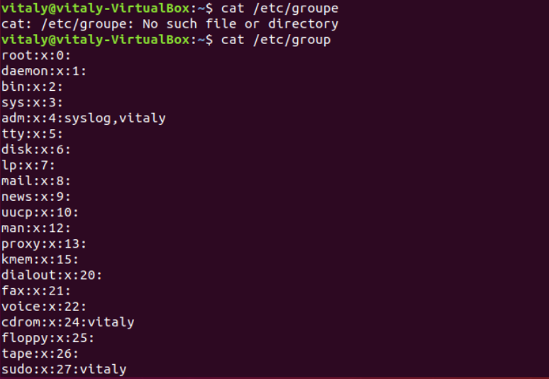

# Task2
### 1) Analyze the structure of the /etc/passwd and /etc/group file, what fields are present in it, what users exist on the system? Specify several pseudo -users, how to define them?

The "/etc/passwd" file contains information about the users on the system. Each line describes a distinct user. Each line has the next structure:

username:password:UID(user_id):GID(group_id):user_id_info(a comment field):home_directory:command/shell

The "/etc/group " file applies to the general security scheme for Unix-like systems: user, group, and file access.

group_name:password:group_id:list

These two files contain information about both real and pseudo-users. The most common pseudo-users:

  - daemon (used by system service processes)
  - bin (gives ownership of executables command)
  - adm (owns registration files)
  - nobody (used by many services)
  - sshd (used by the secure shell server)

Pseudo-users have UID range from 1 to 999. Also, we can identify pseudo-users by looking at the last field of the line. It typically contains “/usr/sbin/nologin” or “/bin/false”. When real users often have access to a shell (”/bin/bash”).

