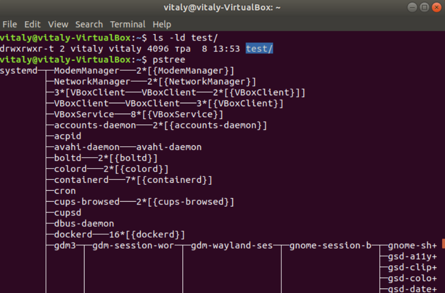
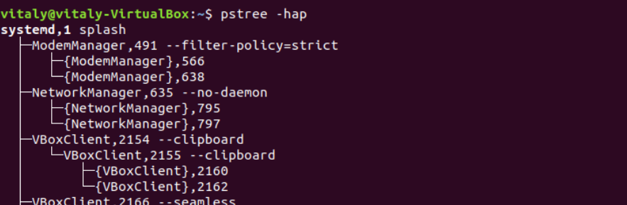
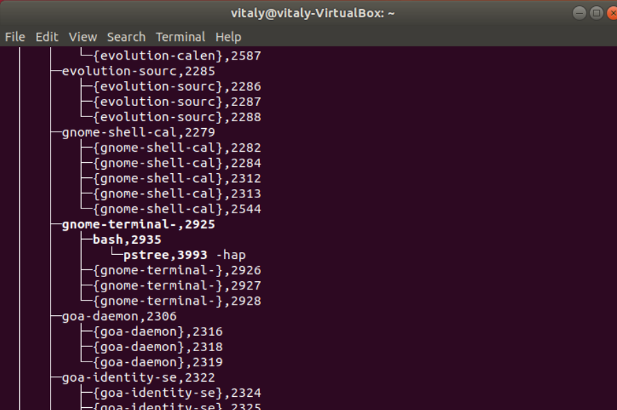
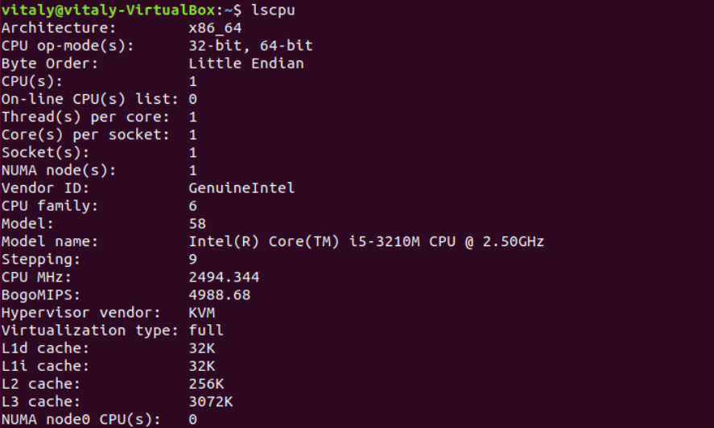

# Part1
### 1. How many states could has a process in Linux?
A Linux process has 5 states:
  -  created;
  -  ready;
  -  waiting;
  -  running;
  -  terminated.
### 2. Examine the pstree command. Make output (highlight) the chain (ancestors) of the current process.

### 3. What is a proc file system?
## Found nice explanation in the RedHat Documentation:

Under Linux, all data are stored as files. We are familiar with the two primary types of files: text and binary. But the /proc/ directory contains another type of file called a virtual file. It is for this reason that /proc/ is often referred to as a virtual file system.

These virtual files have unique qualities. Most of them are listed as zero bytes in size and yet when one is viewed, it can contain a large amount of information. In addition, most of the time and date settings on virtual files reflect the current time and date, indicative of the fact they are constantly updated. Virtual files such as /proc/interrupts, /proc/meminfo, /proc/mounts, and /proc/partitions provide an up-to-the-moment glimpse of the system's hardware. Others, like the /proc/filesystems file and the /proc/sys/ directory provide system configuration information and interfaces.

For organizational purposes, files containing information on a similar topic are grouped into virtual directories and sub-directories. For instance, /proc/ide/ contains information for all physical IDE devices. Likewise, process directories contain information about each running process on the system.
### 4. Print information about the processor (its type, supported technologies, etc.).

### 5. Use the ps command to get information about the process. The information should be as follows: the owner of the process, the arguments with which the process was launched for execution, the group owner of this process, etc.
