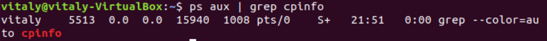
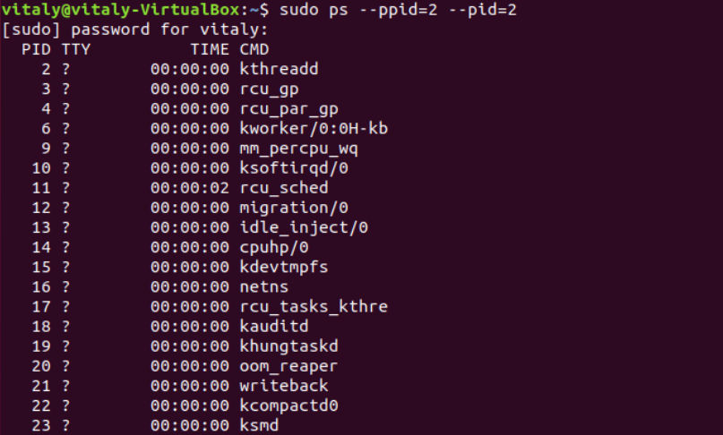
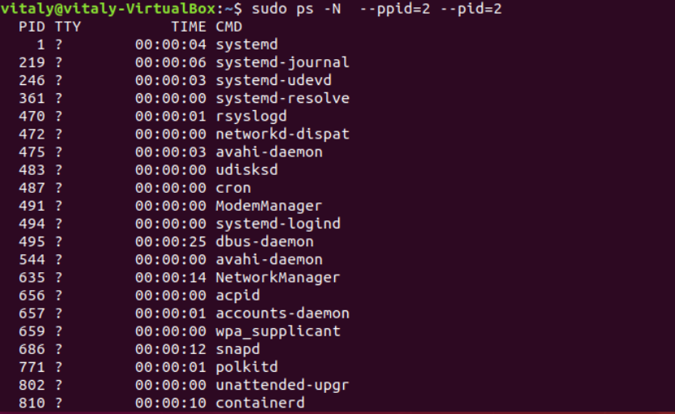
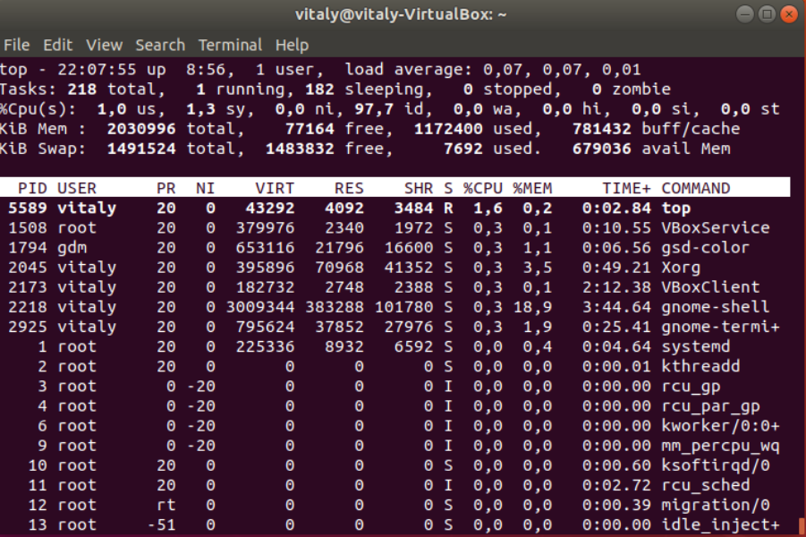
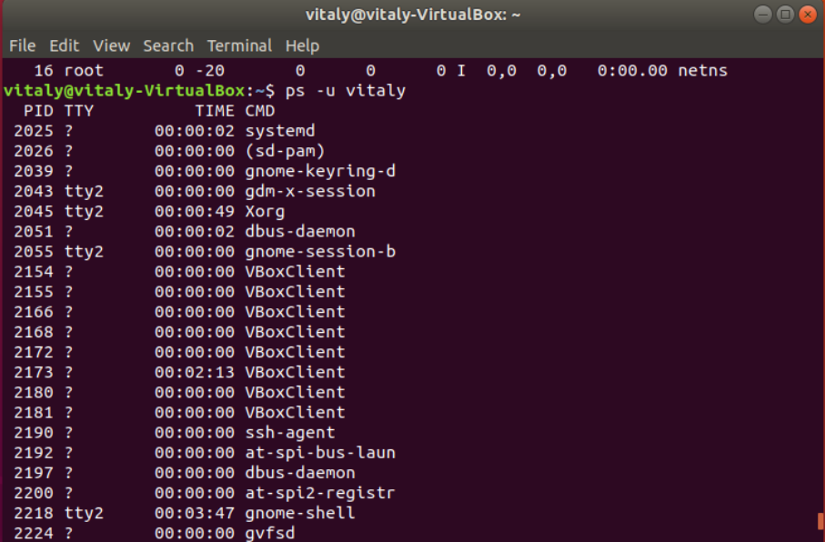
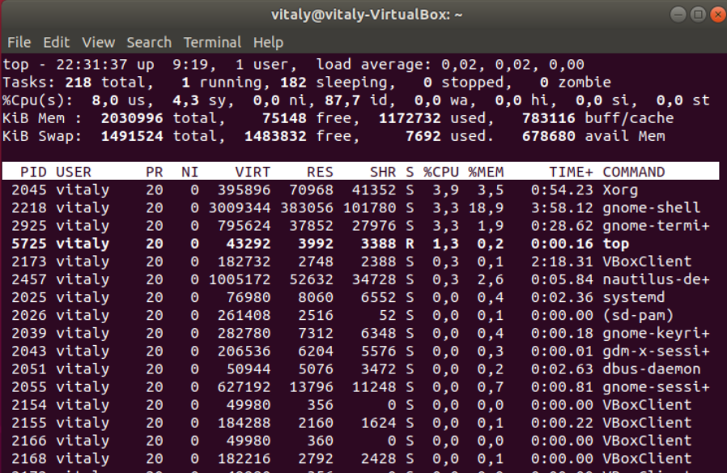
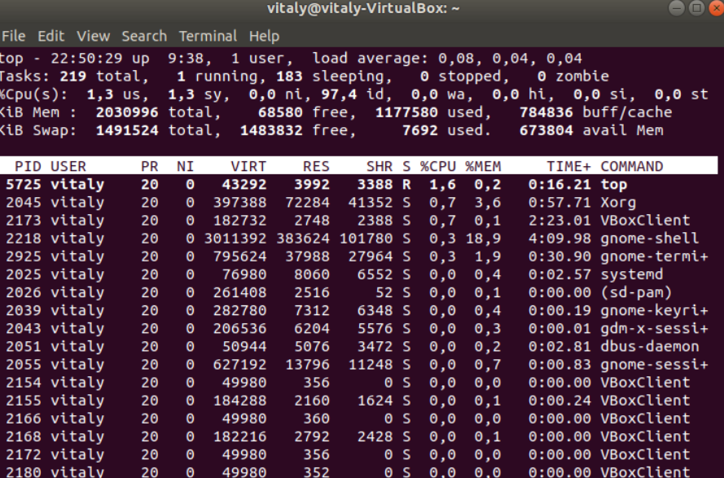
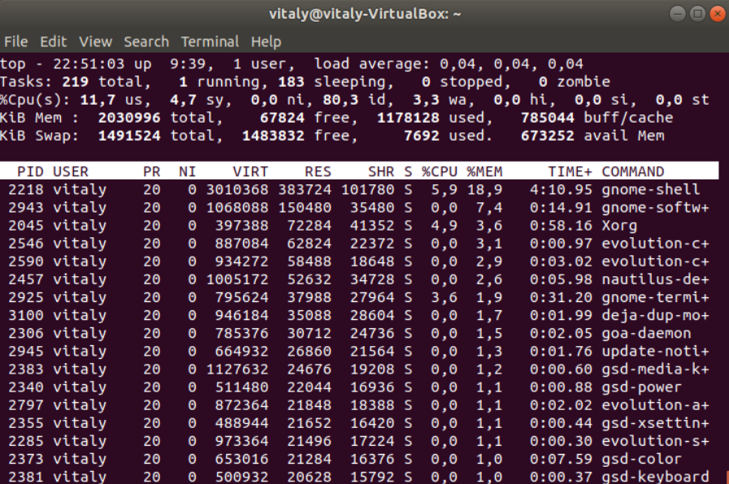
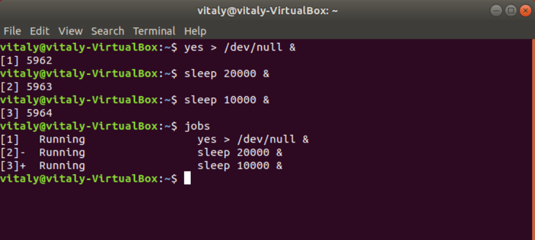
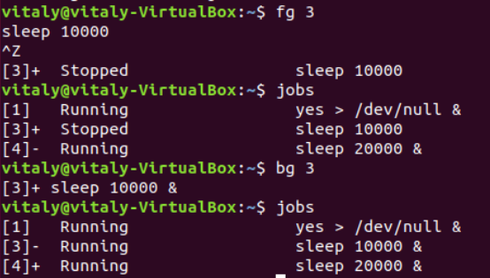

# Part1
### 1. How many states could has a process in Linux?
A Linux process has 5 states:
  -  created;
  -  ready;
  -  waiting;
  -  running;
  -  terminated.
### 2. Examine the pstree command. Make output (highlight) the chain (ancestors) of the current process.

### 3. What is a proc file system?
## Found nice explanation in the RedHat Documentation:

Under Linux, all data are stored as files. We are familiar with the two primary types of files: text and binary. But the /proc/ directory contains another type of file called a virtual file. It is for this reason that /proc/ is often referred to as a virtual file system.

These virtual files have unique qualities. Most of them are listed as zero bytes in size and yet when one is viewed, it can contain a large amount of information. In addition, most of the time and date settings on virtual files reflect the current time and date, indicative of the fact they are constantly updated. Virtual files such as /proc/interrupts, /proc/meminfo, /proc/mounts, and /proc/partitions provide an up-to-the-moment glimpse of the system's hardware. Others, like the /proc/filesystems file and the /proc/sys/ directory provide system configuration information and interfaces.

For organizational purposes, files containing information on a similar topic are grouped into virtual directories and sub-directories. For instance, /proc/ide/ contains information for all physical IDE devices. Likewise, process directories contain information about each running process on the system.
### 4. Print information about the processor (its type, supported technologies, etc.).

### 5. Use the ps command to get information about the process. The information should be as follows: the owner of the process, the arguments with which the process was launched for execution, the group owner of this process, etc.

### 6. How to define kernel processes and user processes?
Kernel process:

User porcess:

### 7. Print the list of processes to the terminal. Briefly describe the statuses of the processes. What condition are they in, or can they be arriving in?

  -  R (running);
  -  S (interruptible sleep (waiting for an event to complete));
  -  D (uninterruptible sleep (waiting for I/O));
  -  T (stopped);
  -  Z (zombie);
  -  X (dead).

### 8. Display only the processes of a specific user.

### 9. What utilities can be used to analyze existing running tasks (by analyzing the help for the ps command)?
Can be used: top, htop, atop.
### 10. What information does top command display?
top displays Linux processes. The command provides a dynamic real-time view of a running system. It can display system summary information as well as a list of processes or threads currently being managed by the Linux kernel.
### 11. Display the processes of the specific user using the top command.

### 12. What interactive commands can be used to control the top command? Give a couple of examples.
or example, we can use:

 - Shift+N to sort by PID;
 - Shift+P to sort by CPU usage;
 - Shift+M to sort by Memory usage;
 - Shift+T to sort by Time usage;
 - Shift+Z to change colors;
 - C to display absolute path of command;
### 13. Sort the contents of the processes window using various parameters (for example, the amount of processor time taken up, etc.)
Processes sorted by the CPU time usage and the memory usage.

### 14. Concept of priority, what commands are used to set priority?
All the processes in Linux are started with a specific priority. By default, all regular processes are started with the priority equal to 20. You can change the priority using the nice and renice commands.

   - nice if you want to start a process with an adjusted priority.
   - renice to change the priority for a currently active process.

When using nice or renice, we can select from priority values ranging from -20 to 19. The default niceness of a process is set to 0 (which results in the priority value of 20). By applying a negative niceness, you increase the priority. Use a positive niceness to decrease the priority. It is a good idea to use increments of 5 and see how it gradually affects the application.
### 15. Can I change the priority of a process using the top command? If so, how?
We can start top utility and press r. Then we will be able to enter PID and change its niceness.
### 16. Examine the kill command. How to send with the kill command process control signal? Give an example of commonly used signals.
#### The kill command is used to send a signal to a process. The most common use is when we need to stop a process. To do this, we can use: kill PID command. The command sends the SIGTERM signal to the process, which normally causes the process to stop its activity.

Sometimes the kill command does not work because the process we want to kill is busy. In that case, we can use kill -9 PID to send the SIGKILL signal to the process. The SIGKILL signal cannot be ignored, so it forces the process to stop, but we also risk losing data while using this command.

Some of the most common signals:

   - SIGTERM (15) to ask a process to stop.
   - SIGKILL (9) to force a process to stop.
   - The SIGHUP (1) to hang up a process resulting in rereading the configuration files of the process. This signal is useful after making modifications to a process configuration file.
### 17. Commands jobs, fg, bg, nohup. What are they for? Use the sleep, yes command to demonstrate the process control mechanism with fg, bg.
 - jobs lists the active jobs.
 - fg moves a job to the foreground.
 - bg moves a job to the background.
 - nohup allows jobs to continue after logout. We can stop nohup process using kill

