# Module – Linux Networking
# Task 5
### 1. На Server_1 налаштувати статичні адреси на всіх інтерфейсах.

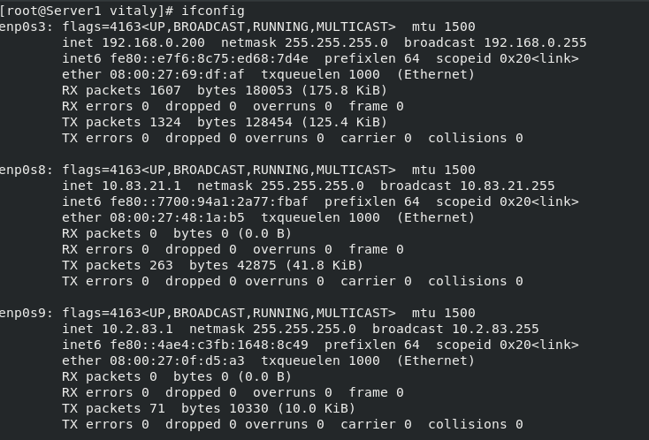
### 2. На Server_1 налаштувати DHCP сервіс, який буде конфігурувати адреси Int1 Client_1 та Client_2
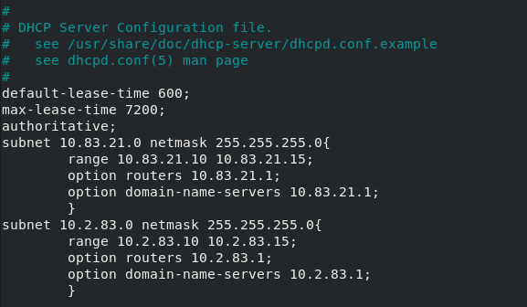
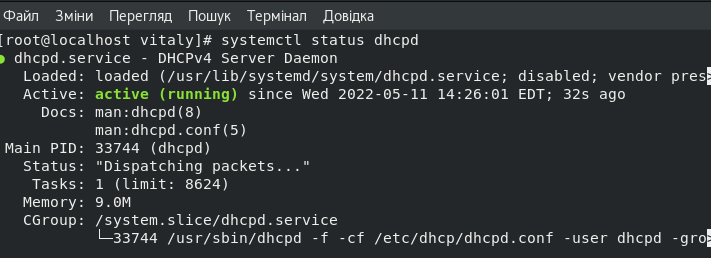
### 3. За допомогою команд ping та traceroute перевірити зв'язок між віртуальними машинами. Результат пояснити.
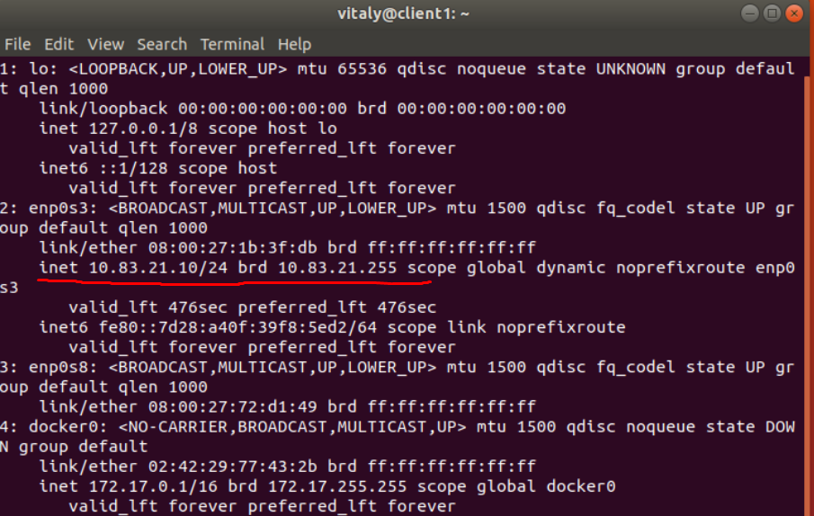
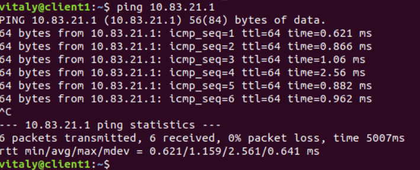
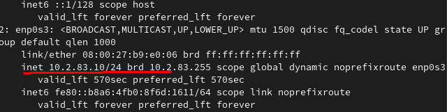
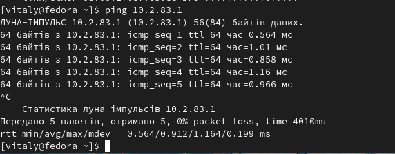
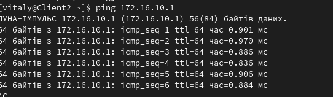
### 4. На віртуальному інтерфейсу lo Client_1 призначити дві ІР адреси за таким правилом: 172.17.D+10.1/24 та 172.17.D+20.1/24. Налаштувати маршрутизацію таким чином, щоб трафік з Client_2 до 172.17.D+10.1 проходив через Server_1, а до 172.17.D+20.1 через Net4. Для перевірки використати traceroute.
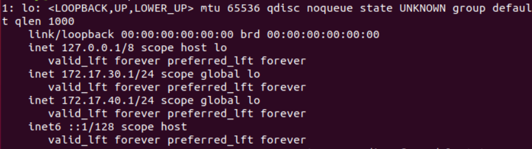
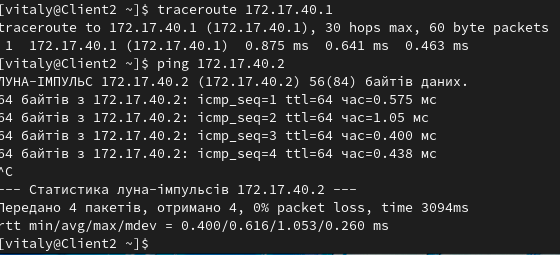
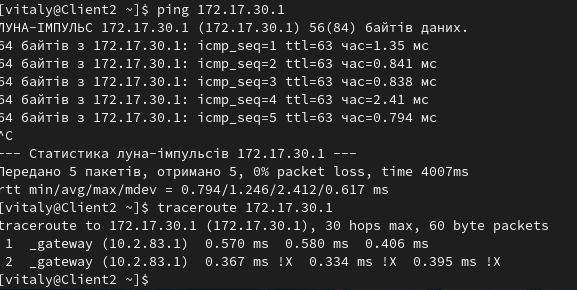
### 5. Розрахувати спільну адресу та маску (summarizing) адрес 172.17.D+10.1 та 172.17.D+20.1, при чому маска має бути максимально можливою. Видалити маршрути, встановлені на попередньому кроці та замінити їх об’єднаним маршрутом, якій має проходити через Server_1.
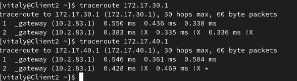
### 6. Налаштувати SSH сервіс таким чином, щоб Client_1 та Client_2 могли підключатись до Server_1 та один до одного.
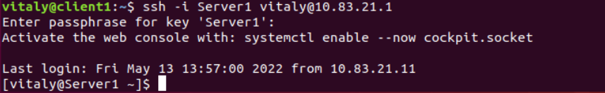
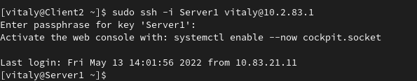
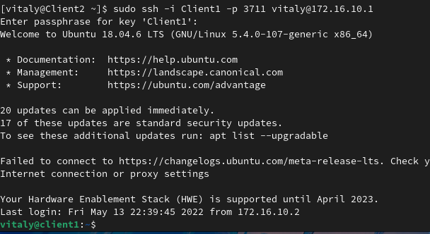
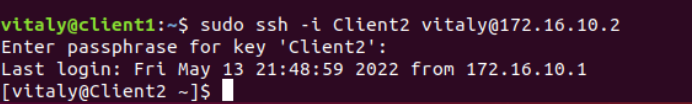
