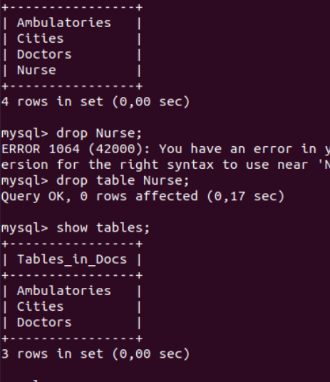
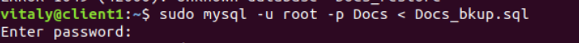
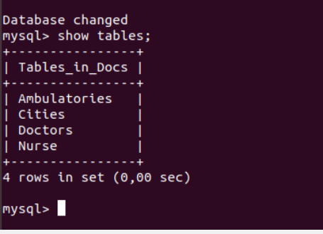
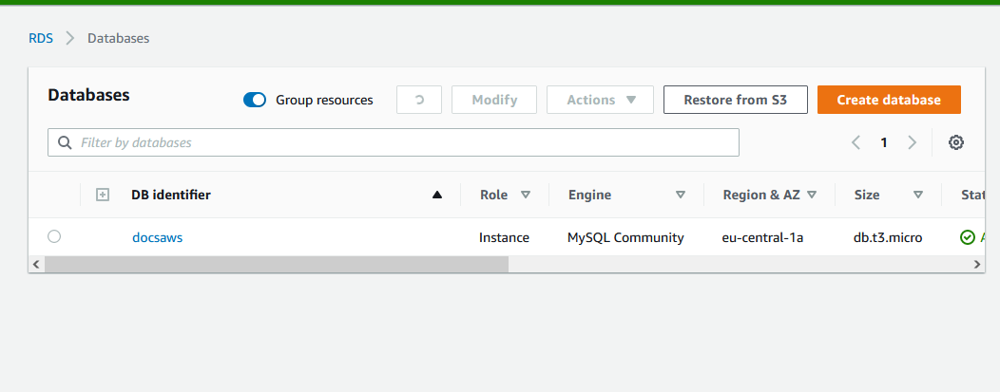
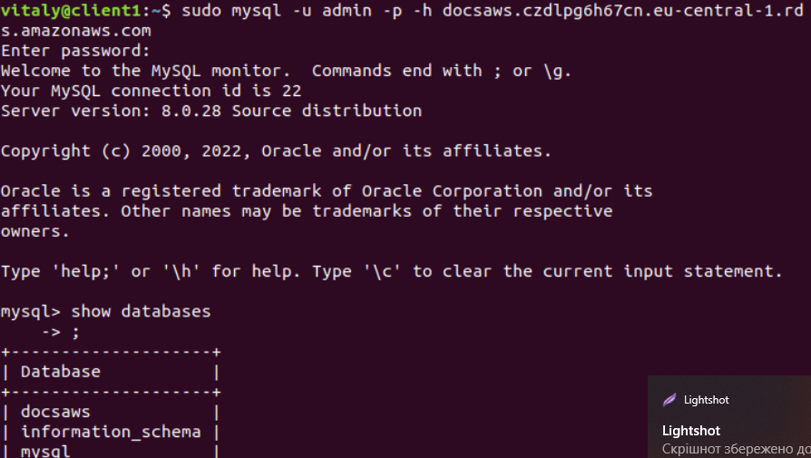
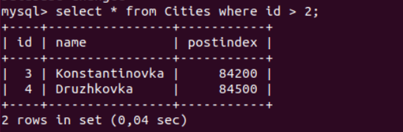
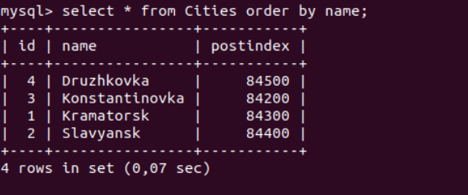
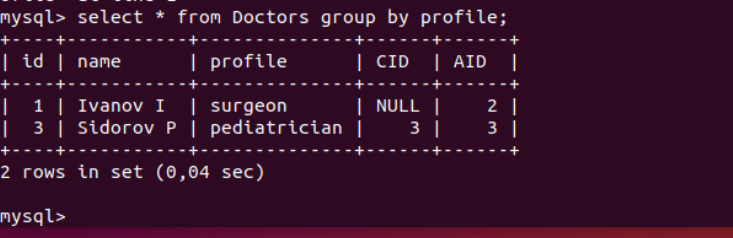
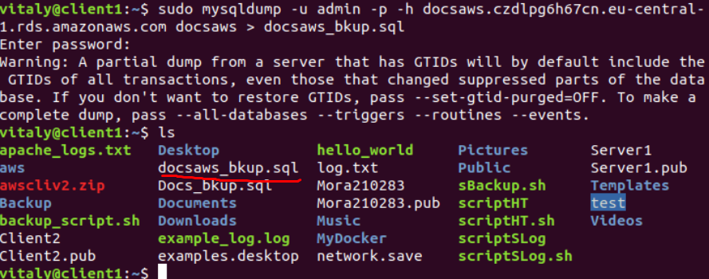

# Module 7 Database Administration
## PART 1
### 1. Download MySQL server for your OS on VM. 
### 2. Install MySQL server on VM. 
### 3. Select a subject area and describe the database schema, (minimum 3 tables)

### 4. Create a database on the server through the console. 
### 5. Fill in tables.

### 6. Construct and execute SELECT operator with WHERE, GROUP BY and ORDER BY.

### 7. Execute other different SQL queries DDL, DML, DCL. 
### 8. Create a database of new users with different privileges. Connect to the database as a new user and verify that the privileges allow or deny certain actions.

### 9. Make a selection from the main table DB MySQL.

## PART 2
### 10.Make backup of your database.

### 11.Delete the table and/or part of the data in the table.

### 12.Restore your database.

### 13.Transfer your local database to RDS AWS.

### 14.Connect to your database. 
### 15.Execute SELECT operator similar step 6.

### 16.Create the dump of your database.

## PART 3 – MongoDB
### 17. Create a database. Use the use command to connect to a new database (If it doesn't exist, Mongo will create it when you write to it).
