# Module 7 Database Administration
## PART 1
### 1. Download MySQL server for your OS on VM. 
### 2. Install MySQL server on VM. 
### 3. Select a subject area and describe the database schema, (minimum 3 tables)
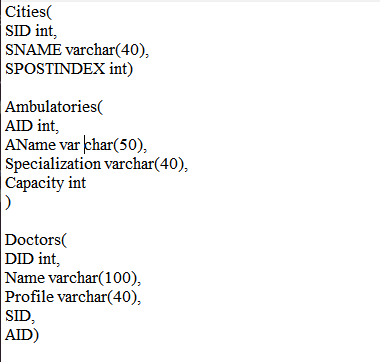
### 4. Create a database on the server through the console. 
### 5. Fill in tables.
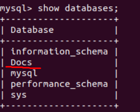
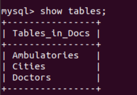
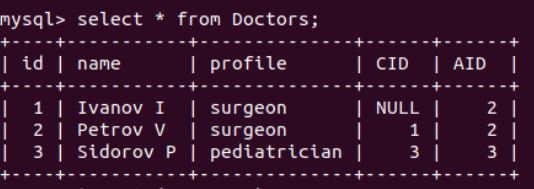
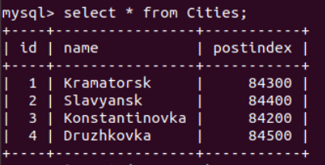
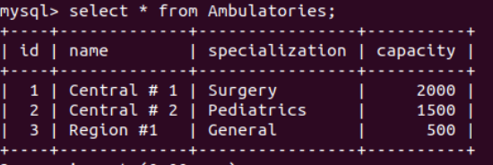
### 6. Construct and execute SELECT operator with WHERE, GROUP BY and ORDER BY.
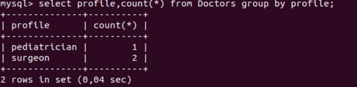
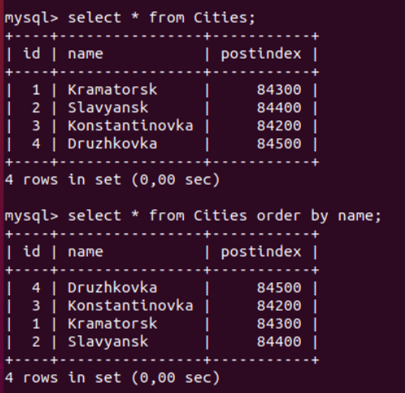
### 7. Execute other different SQL queries DDL, DML, DCL. 
### 8. Create a database of new users with different privileges. Connect to the database as a new user and verify that the privileges allow or deny certain actions.
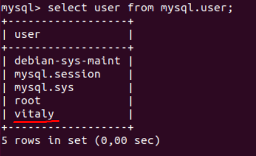
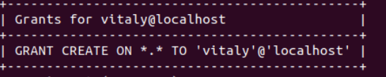
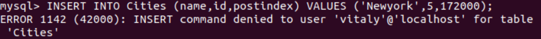
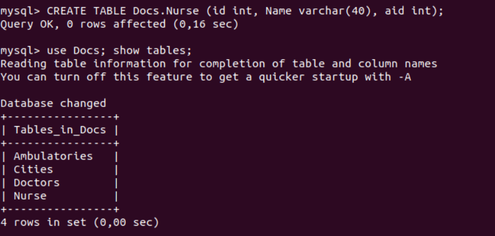
### 9. Make a selection from the main table DB MySQL.
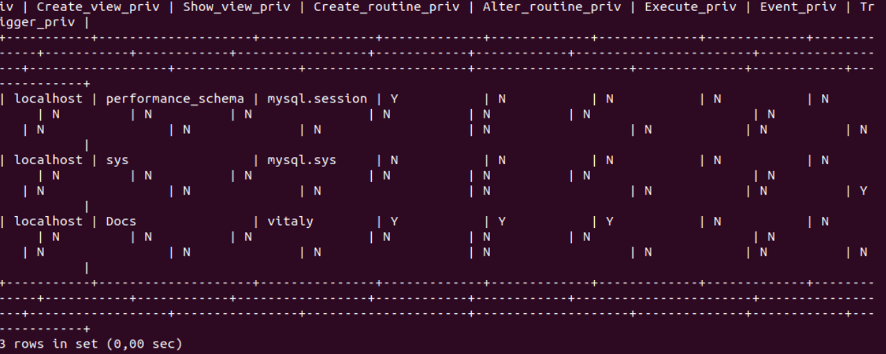
## PART 2
### 10.Make backup of your database.
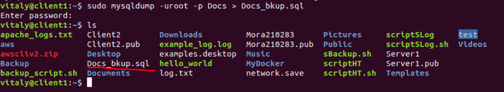
